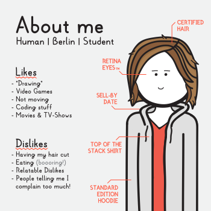

# About



## RSS
There is an [ATOM Feed](ptbd.jwels.berlin/feed), a [RSS Feed](ptbd.jwels.berlin/feed/rss) and a [JSON Feed](ptbd.jwels.berlin/feed/json) you can subscribe to.

## Settings
### Dark Mode
Some people really like bright white letters on a dark background that slowly burn your retinas away. If you want that sparkling sensation as well, please feel free to activate dark-mode.

<Settings type="theme" default="light" afterUpdate="__setTheme" :options="[{ name: 'light', label: 'Light Theme' }, { name: 'dark', label: 'Dark Theme' }]" />

Please note that [some older browsers](https://caniuse.com/#feat=css-variables) don't support this feature.

### Comic Layout
By default the panel layout is determined by your screen width. You can also force a one-column or two-column layout if you want to see more details for example.

<Settings type="layout" default="auto" afterUpdate="__setLayout" :options="[{ name: 'auto', label: 'Auto Layout' }, { name: 'col1', label: 'One-Column Layout' }, { name: 'col2', label: 'Two-Column Layout' }]" />

## License


My Comics are licensed under a [Creative Commons Attribution-NonCommercial-NoDerivatives](http://creativecommons.org/licenses/by-nc-nd/4.0/) License.

## Permalinks
I am trying to guarantee that the links listed here will always work, no matter what.

```
ptbd.jwels.berlin/comic/[comicID]
ptbd.jwels.berlin/assets/thumbnail/[comicID].[ext]
ptbd.jwels.berlin/share/[comicID].[ext]
```
```
ptbd.jwels.berlin/feed
ptbd.jwels.berlin/feed/rss
```
```
ptbd.jwels.berlin/archive
ptbd.jwels.berlin/archive/[year]
```

Individual panels change their filenames when their content changes (e.g. when I remove some typos), therefore it is not a good idea to copy their links directly.